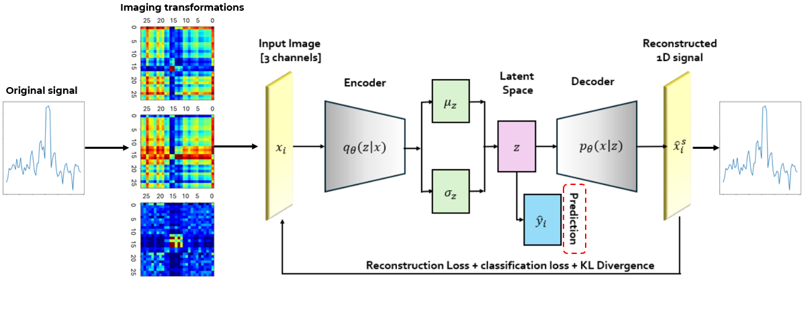

# Failure Prediction in Electrolyzers with Interpretable Image-Based Deep Learning and Unsupervised Domain Adaptation

### Abstract:
 Accurate and timely failure prediction in industrial electrolysis systems is crucial for minimizing downtime, reducing maintenance costs, and ensuring operational efficiency. This paper presents a novel machine-learning approach for failure prediction in analyzing steam electrolyzers. It transforms time series data into multi-channel 2D images, enabling the application of advanced deep learning techniques. Our method employs a Variational AutoEncoder (VAE) to encode these images and reconstruct the original signals, effectively capturing relevant features. We incorporate an Unsupervised Domain Adaptation (UDA) technique to enhance robustness and adaptability across diverse datasets, ensuring the model can generalize well to various operational conditions. Additionally, we improve interpretability by integrating a counterfactual explanation module that identifies minimal changes in input signals needed to alter prediction outcomes. Our comprehensive approach significantly advances predictive accuracy on target domains of unseen datasets, achieving over a $20\%$ accuracy gain and superior reconstruction results with $39\%$ less mean absolute percentage error compared to direct supervised training approaches. This results in $90.8\%$ accuracy and $19.2\%$ mean absolute percentage error.  Our method produces plausible counterfactual observations, highlighting the symptoms of failures in electrolyzers.


### Pipeline:



### Setup 

```Shell
pip install -r requirements.txt
```

### Code 

We prepared a jupyter to demonstrate our approach and its different steps, however, and for confidentiality reasons the data used to run the code is just synthetic signals created to show the format of our original signals in the study. We tried to mimic the noise problems in the electrolyzers voltage signals that we described in the paper and shoe the different preprocessing steps we followed. 
